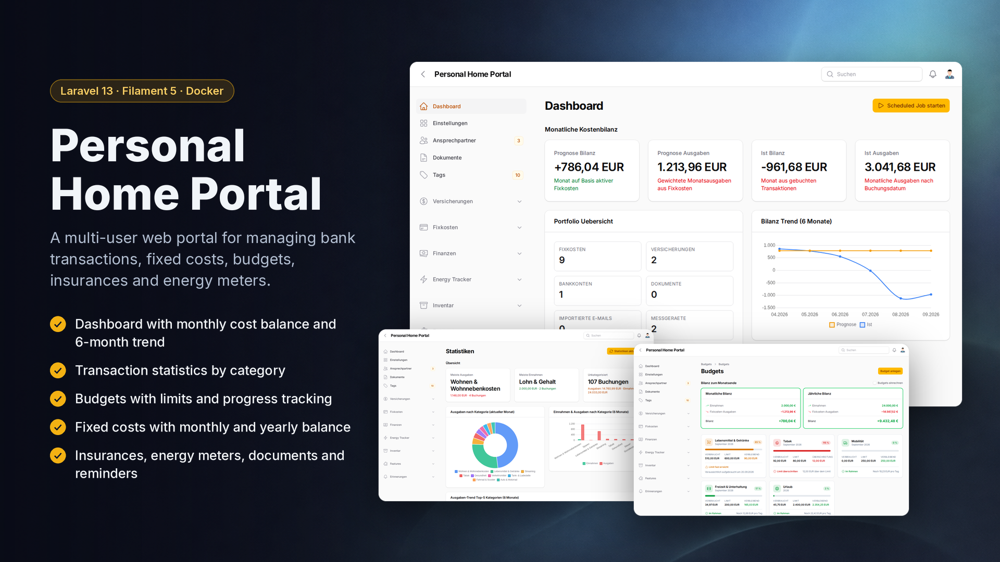

# Household HQ



A self-hosted, multi-tenant portal for managing personal finances, insurances, contracts, energy consumption,
documents and household inventory - built with Laravel and Filament.

## 📖 About

Household HQ keeps the paperwork of running a household in one place. Every user has their own private
data (accounts, transactions, insurances, contracts, ...); admins additionally manage users and global settings
from a separate panel. See [docs/index.md](docs/index.md) for the full project definition.

**Stack:** PHP 8.5 · [Laravel 13](https://laravel.com/docs/13.x) · [Filament 5](https://filamentphp.com/docs/5.x/)
· MySQL 8 · Redis + [Laravel Horizon](https://laravel.com/docs/13.x/horizon)

## ✨ Features

- **Financial**
  - Bank accounts with CSV import profiles for statements
  - Transactions with rule-based, recursive categorization (with per-user blacklist rules) and full-text statistics
  - Budgets linked to transaction categories, tracked against spending targets
  - Fixed costs: due-date tracking, automatic transaction matching, recurring-payment detection, booking-date
    suggestions, and a liquidity/balance overview (see [Fixed Cost Jobs](docs/fixed-cost-jobs.md))
  - Savings goals with contributions and progress tracking
  - Insurances with categories and linked contact persons
- **Energy tracker** - measurement devices, meter readings, contracts with pricing and cost forecasts
- **Documents** - IMAP import of attachments/invoices, a wizard to merge scanned images into a PDF, and an
  address-change notification wizard (insurances/banks, by e-mail or PDF)
- **Inventory** - articles, collections and locations for household belongings
- **Reminders** - a central, cross-model reminder system (fixed costs, insurances, ...)
- **Dashboard** - per-user configurable widgets (stats, charts, tables) on top of a curated template registry
  (see [Admin Dashboard](docs/dashboard-admin.md))
- **Tags, comments and application logs** across the models that support them
- **Admin panel** - user & role management, global settings, and a [Horizon](https://laravel.com/docs/13.x/horizon)
  navigation item for queue monitoring

## 🚀 Getting Started

### Option A: Docker image (recommended)

The published image bundles the app, Horizon, the scheduler, MySQL and Redis into a single container - no compose
file needed. Full reference: [docs/docker-image.md](docs/docker-image.md).

```bash
docker run -d \
  --name household-hq \
  -p 8080:80 \
  -v household-hq-data:/data \
  ghcr.io/cooolinho/household-hq:latest \
  --demo
```

`--demo` seeds demo users, accounts, transactions and more on first start. Open <http://localhost:8080/app/login>:

| Panel | E-Mail | Password |
|---|---|---|
| App (owns the demo data) | `user@example.com` | `secret` |
| Admin (`/admin`, `/horizon`) | `admin@example.com` | `secret` |

For a real deployment, drop `--demo` and set your own admin instead:

```bash
docker run -d \
  --name household-hq \
  -p 8080:80 \
  -v household-hq-data:/data \
  -e APP_URL=https://portal.example.com \
  -e ADMIN_EMAIL=admin@example.com \
  -e ADMIN_PASSWORD='change-me-immediately' \
  --stop-timeout 60 \
  ghcr.io/cooolinho/household-hq:latest
```

### Option B: Local development

Runs the app via [Laravel Sail](https://laravel.com/docs/13.x/sail)-style containers with the code bind-mounted for
hot reload - this is what the [`docker-compose.yml`](docker-compose.yml) in this repo is for, not the Docker image
above.

```bash
git clone git@github.com:cooolinho/household-hq.git
cd household-hq
cp .env.example .env

docker-compose build
docker-compose up -d

docker exec -it household-hq bash -c "chmod -R 777 /var/www/html"
docker exec -it household-hq bash -c "chown -R sail:sail /var/www/html"
docker exec -it --user sail household-hq sh -c "sh init.sh"

# create your admin account (see Usage below for what this does)
docker exec -it --user sail household-hq sh -c "php artisan app:create-admin-user"

docker restart household-hq
```

Open <http://localhost/app/login>. Set your own `LARAVEL_CONTAINER_NAME` in `.env` first if you want a container
name other than `household-hq`.

## 📋 Usage

### Login & panels

There is one central login for both panels; after signing in, admins are redirected to `/admin`, everyone else to
`/app`. Registration (`/app/register`) is disabled by default - set `AUTH_REGISTRATION_ENABLED=true` to allow
self-signup (new accounts are always regular, unverified users; verify or promote them from the Admin-Panel's
"Benutzer" resource).

### Creating an administrator

```bash
docker exec -it --user sail household-hq sh -c "php artisan app:create-admin-user"
```

Prompts for name/e-mail/password (or pass `--name=`, `--email=`, `--password=` non-interactively). Leaves an
existing account with that e-mail untouched instead of overwriting its password.

### Demo data

```bash
# all idempotent demo seeders
docker exec -it --user sail household-hq sh -c "php artisan db:seed"

# choose a single seeder or a grouped domain (e.g. "Financial") interactively
docker exec -it --user sail household-hq sh -c "php artisan app:seed-demo-data"
```

To replace outdated system transaction categories, run the interactive reset command (deletes only system
categories, or all categories including user-created ones, then re-runs the system seeder; transactions keep
existing but lose their deleted category assignments):

```bash
docker exec -it --user sail household-hq sh -c "php artisan app:reset-transaction-categories"
```

### Queue & Horizon

Queued jobs run through [Laravel Horizon](https://laravel.com/docs/13.x/horizon) on the Redis `default` queue.
Admins reach the dashboard from a navigation item in `/admin`, or directly at `/horizon`.

### Updating

- **Docker image:** pull the new tag and recreate the container against the same `/data` volume - see
  [docs/docker-image.md](docs/docker-image.md#persistence-and-updates). Migrations run automatically on start.
- **Local development:**
  ```bash
  ./update dev    # or: ./update prod
  ```
  Pulls, rebuilds/recreates the stack, reconciles the supervisor programs (`docker/supervisord.conf`), installs
  PHP/JS dependencies, builds both Filament themes, runs migrations, and restarts Horizon. Refuses to run unless
  `QUEUE_CONNECTION=redis` in `laravel/.env`.

### Helper scripts (local development)

- `./app <command>` - shortcuts for common in-container commands (`migrate`, `test`, `tinker`, `bash`, ...) plus an
  interactive menu; see `./app --help`.
- `./supervisor.sh` - interactive status/start/stop/restart/log-tail for the supervisor-managed processes
  (`php`, `horizon`, `scheduler`) inside the dev container.

## 📁 Project Structure

```
household-hq/
├── Dockerfile                # All-in-one production image (app + workers + MySQL + Redis)
├── docker-compose.yml         # Local dev stack (bind-mounted, hot reload)
├── docker-compose.prod.yml    # Reference prod compose (Traefik, persistent volumes)
├── docker/                    # Dev image (Sail-based); docker/all-in-one/ backs the Dockerfile above
├── laravel/                   # The Laravel/Filament application
│   ├── app/                   #   Models, Filament resources/pages/widgets, jobs, services, console commands
│   ├── database/              #   Migrations, factories, seeders, settings migrations
│   ├── resources/             #   Blade views, per-panel Filament theme SCSS, JS
│   ├── routes/                #   web.php, console.php (scheduled jobs)
│   └── tests/                 #   PHPUnit feature/unit tests
├── docs/                      # Project documentation (see below)
├── app, update, supervisor.sh # Dev helper scripts
└── .github/workflows/         # CI: builds/tests/publishes the Docker image
```

## 📚 Documentation

- [Docker Image](docs/docker-image.md) - all-in-one image reference, environment variables, backup/updates
- [Project Definition](docs/index.md)
- [Admin Dashboard](docs/dashboard-admin.md)
- [Fixed Cost Jobs](docs/fixed-cost-jobs.md)
- [TODOs](docs/todos.md)
- [AGENTS.md](AGENTS.md) - contributor/agent guide (stack conventions, key files, panel structure)

## 🔗 References

- [Filament 5](https://filamentphp.com/docs/5.x/)
- [Laravel 13](https://laravel.com/docs/13.x)
- [Laravel Horizon](https://laravel.com/docs/13.x/horizon)
- [Docker](https://www.docker.com/)
- [Docker Compose](https://docs.docker.com/compose/)
- [GitHub Container Registry](https://docs.github.com/en/packages/working-with-a-github-packages-registry/working-with-the-container-registry)
- [MySQL](https://hub.docker.com/r/mysql/mysql-server)
- [Redis](https://hub.docker.com/_/redis)
- [nginx](https://nginx.org/en/docs/)
- [Supervisor](http://supervisord.org/)
- [mailpit](https://hub.docker.com/r/axllent/mailpit)
- [spatie/laravel-tags](https://spatie.be/docs/laravel-tags/v4/introduction)

## 📄 License

[MIT](LICENSE)
